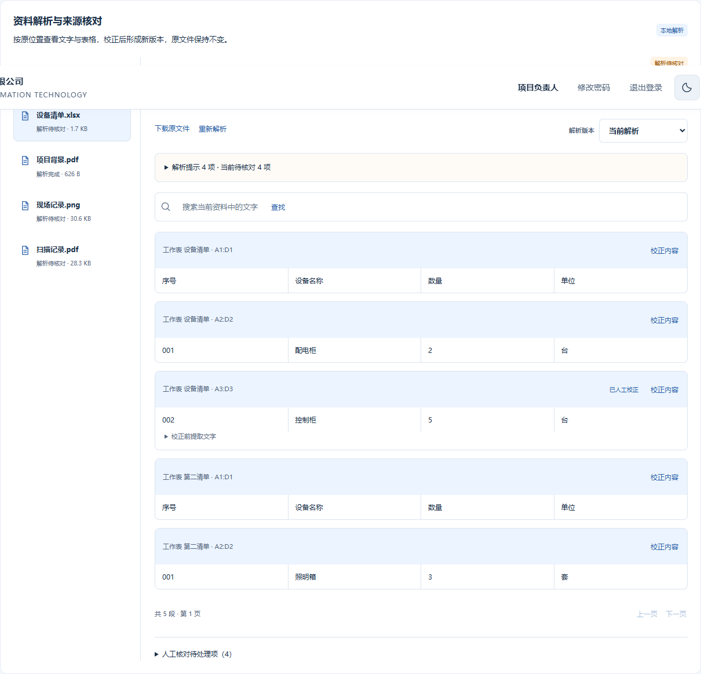
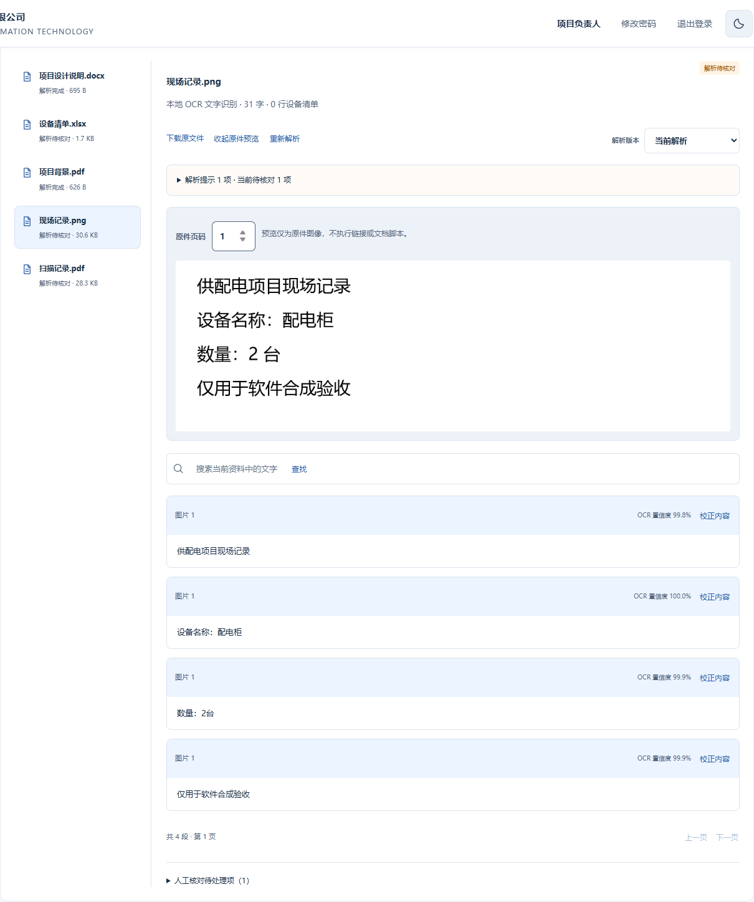
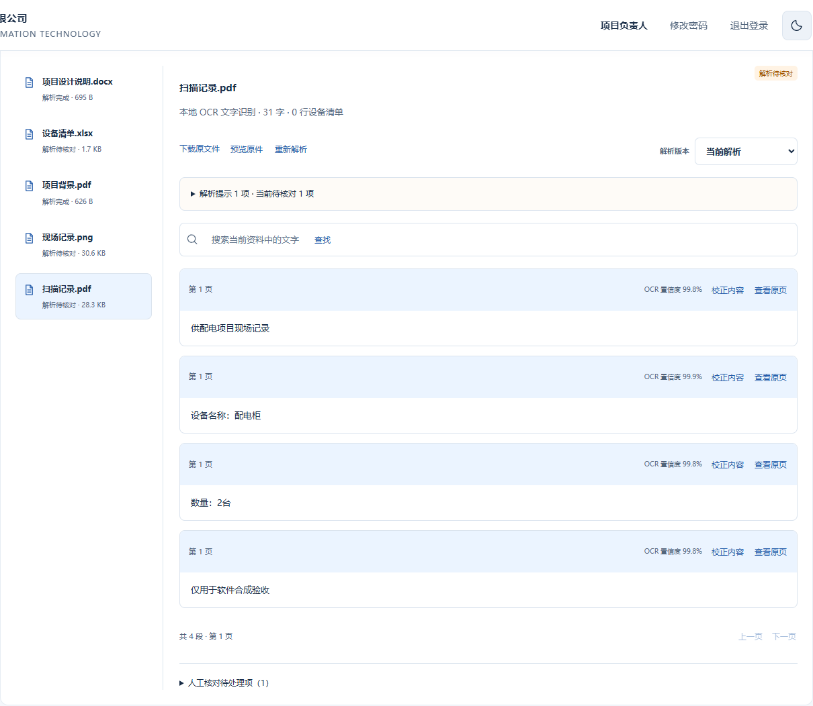
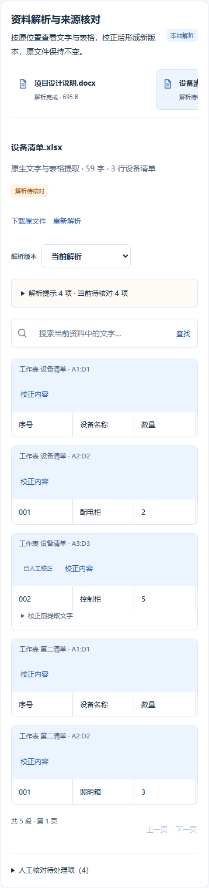

# 多格式资料解析验收

2026-09-26。实际 Chrome、真实 Django 接口与本地解析子进程；全部使用合成资料，不含客户数据或访问凭据。完整说明见 [多格式解析](../../MULTIFORMAT_INTAKE.md)。

`results.json` 记录 11 项浏览器检查：五格式上传、Word 定位、Excel 公式/校正、历史只读、中文 OCR 与原图、扫描 PDF 页码、越权拒绝、损坏文件回滚、审核人核对、390px 布局、无运行时错误与外发请求。

## Excel 原始单元格与人工校正

## 中文 OCR、置信度与原图

## 扫描 PDF

## 手机资料核对

最终自动化测试结果见 `validation.json`。截图是实际浏览器输出，不是未来产品效果图；图像识别质量与业务事实仍需原件核对。
