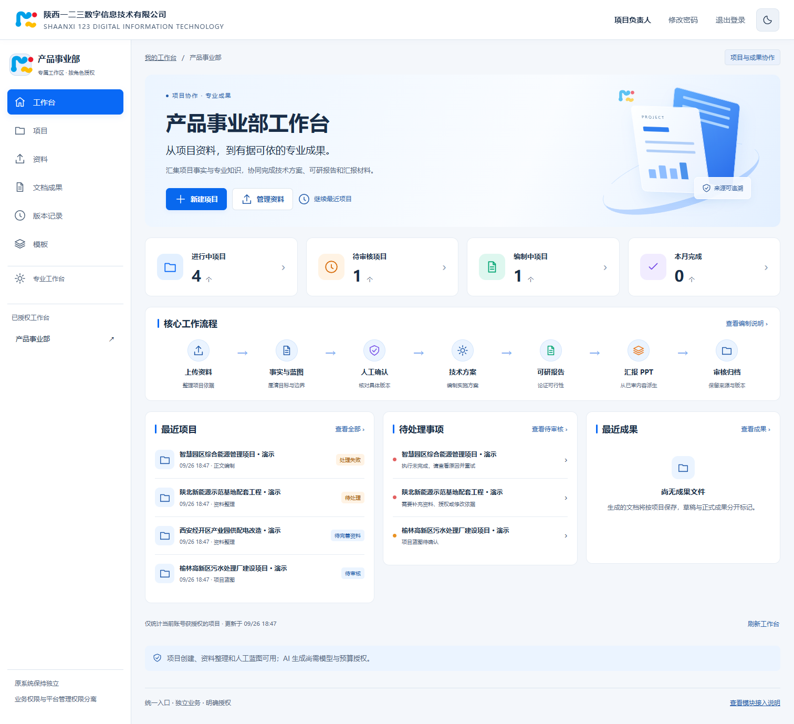
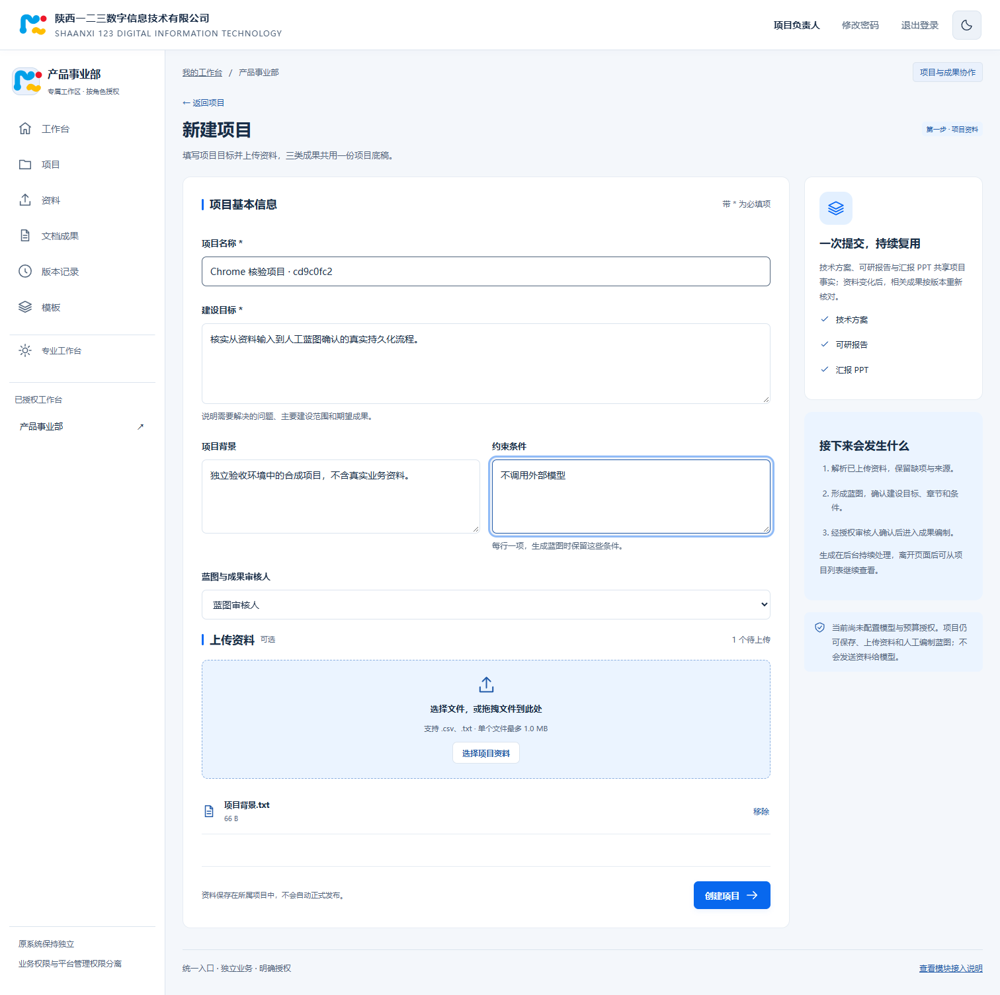
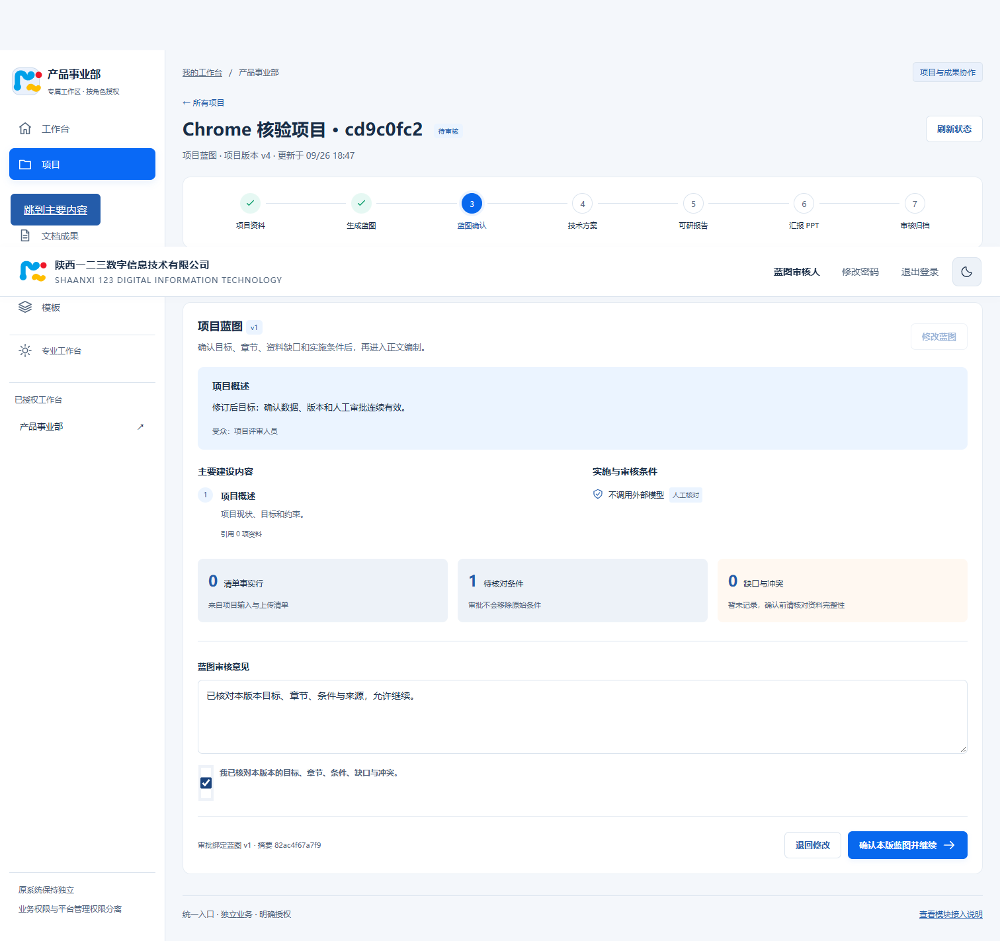
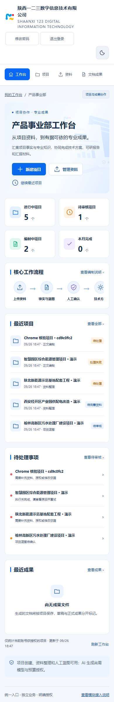

# 产品事业部工作台浏览器证据

2026-09-26，独立本地 Django 服务 + 实际 Chrome，合成项目，真实 HTTP 与权限接口。14 项流程检查通过，结果见 `results.json`。完整验证范围与限制见 `../../WORKBENCH_VALIDATION.md`。

页面截图是实际生成的浏览器画面，不是效果图或预设示例数字；所有项目数据均为合成验收数据。自动布局检查不等于完整视觉签认。

## 工作台（1512px）

## 新建项目

## 指定审核人确认蓝图

## 手机宽度（390px）

