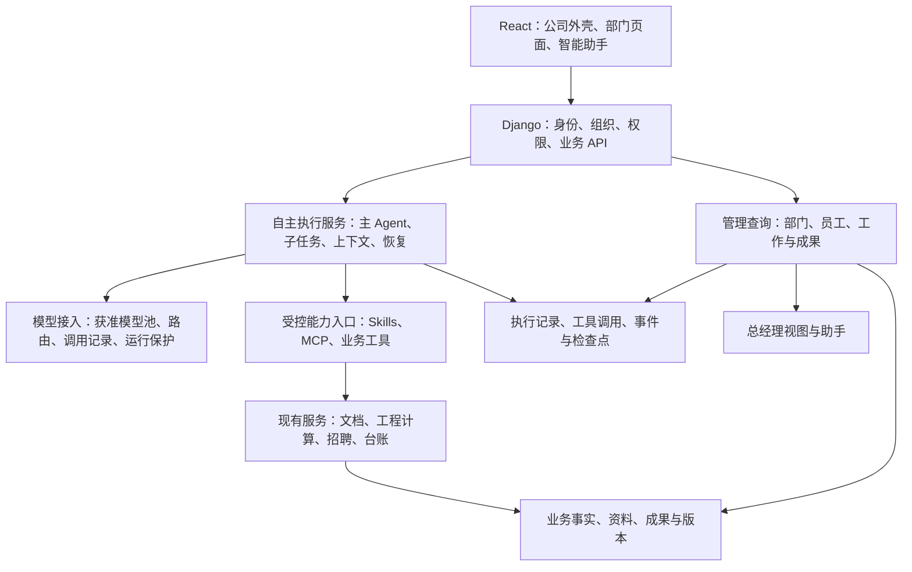

# 企业智能助手平台：产品与架构讨论纪要

> 整理日期：2026-09-30
> 本轮修订：明确 Agent、Harness 与 Runtime 的关系，优先复用现成执行能力；统一首期技能、多模型协作和平台适配边界。
> 记录用途：保存本次连续讨论，作为后续原型、架构验证和开发拆解的需求依据，避免上下文丢失。
> 文档状态：讨论基线，尚非实施完成报告或最终技术设计。
> 代码背景：讨论时本地仓库为 `main`，提交 `7600718`。记录的是该背景上的演进目标，不表示目标能力已经实现。

## 1. 阅读约定与核心结论

- **已确认需求**：用户在讨论中明确提出或认可的产品方向，后续设计不应无故退回此前被纠正的方案。
- **建议方案**：为实现需求提出的页面细节、技术分层、数据关系与实施顺序，仍可在设计和验证中调整。
- **待验证／待确认**：尚未通过原型或业务规则确认的事项，不应写成现有能力或已获批准的实现。
- 本次仅整理文档，不构成对代码重构、生产部署、安装第三方执行器或付费调用的执行授权。
- 本轮已确认的设计原则是**尽量不重复造轮子**：使用现成 Harness 构建企业 Agent，优先复用已有业务服务；具体版本、部署与适配方案仍须原型验证，第 16 节为当前执行架构口径。

### 1.1 一句话定义

**保留现有公司门户和部门工作台，在各部门内置统一的智能助手页面；用户用自然语言表达需求或提供资料，主 Agent 持续自主执行，必要时自主委派子 Agent，并使用 Skills、MCP 和业务工具完成工作。工作过程与成果沉淀到项目、历史和版本体系，总经理可以通过助手查询、汇总并直接打开各部门员工的工作。**

### 1.2 不可偏离的产品原则

1. 外层仍是企业平台，不把整个网站改成一个通用聊天产品。
2. 公司 Logo、部门标识和现有侧边栏结构保留。
3. 原“生成文档”入口改为“智能助手”，能力不限于生成文档。
4. 助手首屏以一个自然语言对话框为核心，不强制用户先选择任务类型。
5. 不要求用户填写 Agent 角色、协作方式、子任务数量、执行流程或模型分工。
6. 主 Agent 自己决定直接执行、委派、并行、复核、返工和整合；简单任务不强制拆分。
7. 用户可以安装、选择技能，但不选择也能开始工作。
8. 上下文、历史、恢复、真实工具执行与成果保存属于核心能力，不是附加装饰。
9. 既有项目、资料、成果和版本页面继续存在，与助手共享记录。
10. 默认路径应减少操作和重复填写，但不得用猜测代替关键业务事实或授权。
11. 自主协作是产品核心；不为实现它从零建设通用 Agent 框架、插件市场或第二套任务调度系统。

## 2. 讨论中已经纠正、不得重新引入的方案

| 早期理解或提议 | 本次最终口径 |
| --- | --- |
| 给现有流程增加几个固定“资料／写作／审核 Agent” | 主 Agent 根据目标和执行结果动态决定是否委派及如何分工，不固定成流水线 |
| 用户选择“自动协作／自定义配置”并安排角色 | 不需要此类用户配置，调度复杂性留在后台 |
| 用户为每项任务指定模型 | 核心体验是后台自主选择获准模型；复杂模型配置不是首版用户交互要求 |
| 整个产品事业部替换成 WorkBuddy 式界面 | 仅参考其 Agent 交互思路；公司品牌、部门工作台和原侧栏保留 |
| “生成文档”页提供“分析资料／编写方案／生成可研／制作 PPT”分类按钮 | 入口更名“智能助手”，首屏不需要这组任务选择按钮；用自然语言理解意图 |
| 每个部门运行一个不同的 Agent 产品 | 建议共用执行能力，通过部门授权、业务工具和数据范围区分 |
| 总经理必须逐层点击部门、员工、成果 | 保留层级导航，同时允许助手直接查询、汇总和打开对象 |
| 先交付单 Agent 聊天，未来再加委派 | 首个核心试点就需要真正的自主委派与不同模型子任务，缩小业务范围而非删除核心体验 |
| 专家系统是必需入口 | 专家可有可无，首版不作为必做系统；不能再引入一套固定团队配置 |
| “不要用户输入”意味着完全不需要目标 | 实际含义是不要重复填写结构化配置；用户仍可表达目标、上传资料，关键歧义做最少量确认 |

## 3. 产品范围与部门使用方式

### 3.1 产品事业部：已确认需求

- 保留事业部首页、历史项目、资料、文档成果、版本记录、商机、知识库问答和售前录入等既有功能。
- “智能助手”是其中一个入口，不替代整个工作台。
- 助手可进行普通问答、项目资料分析、文档生成、修改和其他获准工作，不限定为文档流水线。
- 用户提供目标后，主 Agent 自主选择可用技能、工具与模型，并在需要时委派子 Agent。
- 工作过程中可以继续提问、纠正、上传补充资料或提出新要求。
- 生成结果既能在当前会话查看，也能在项目、成果及版本页面找到。

### 3.2 工程部门：已确认方向与待定业务口径

- 与产品部采用同一种助手交互，不再让用户学习另一套 Agent 编排方式。
- 上传设备清单后，可分析设备、查找获准价格依据、计算成本及其他价格结果。
- 主 Agent 可按设备类型或分析需求自主委派并行子任务，核查型号、单位、数量、价格差异和漏项。
- **待确认**：“各种价格”的首批口径尚未确定。讨论涉及采购参考价、成本价、含税／不含税、运输安装等项目成本及报价草稿，不能默认全部已纳入首版。
- **建议**：金额计算由确定性业务服务完成；Agent 负责资料理解、匹配、查询、分析、调用计算工具和解释。
- **建议**：保存清单行、设备匹配、价格来源、日期、币种、税口径、规则版本、计算结果及确认状态。无依据的价格标记为估算或待询价。

### 3.3 人事与财务：统一交互，保留业务边界

- 其他部门同样可内置智能助手，用自然语言查询、汇总、打开或处理获准业务。
- 人事助手可围绕现有岗位、招聘批次和结果开展工作；财务助手可围绕台账、异常及汇总工作。
- 首批具体业务工具范围、敏感数据访问规则和写操作权限需要另行明确。
- 不因增加助手就自动开放正式发布、对外发送、删除、报价审定或敏感数据全量读取。

### 3.4 总经理：已确认需求

总经理首页有四个部门入口：

```text
总经理工作台
├─ 产品事业部
├─ 人事部
├─ 工程部
└─ 财务部
```

- 点击部门可以查看部门工作台和员工列表；点击员工可以查看其平台内工作情况。
- 同时内置智能助手，不要求总经理必须逐级点击。
- 可直接要求“汇总本周各部门每个人的工作成果”“看张三最近的方案”“打开第二个”“比较最新版本和上一版”。
- 助手应查询真实记录并打开对应任务或成果，而不是只告诉用户点击路径。
- 汇总保留时间范围、数据截止时间、来源和成果入口，区分进行中、待审核、失败、已完成等状态。
- 用户首期暂不需要总经理查看工作任务的完整对话过程，避免信息冗杂；管理查看默认提供业务摘要、状态、结果／成果、版本和必要来源，不新增完整聊天记录阅读入口。工作历史仍由员工侧保存，不因管理页不展示而删除归档。
- 平台没有工作记录，不应推断为员工没有工作；不得凭记录数量自动评价绩效。
- 查看范围首先指平台内产生或关联的业务工作，不自动涵盖员工电脑、私人聊天和外部系统所有活动。

## 4. 页面与交互设计

### 4.1 企业外壳不变

```text
公司 Logo / 当前部门 / 当前用户
┌────────────────┬──────────────────────────────────┐
│ 现有侧边栏      │ 当前业务页面                      │
│ 工作台          │                                  │
│ 历史项目        │ 点击“智能助手”后，在这里进入       │
│ 资料            │ 自然语言任务与执行页面             │
│ 文档成果        │                                  │
│ 版本记录        │ 其他业务页面继续保留               │
│ ……              │                                  │
│ 智能助手        │                                  │
└────────────────┴──────────────────────────────────┘
```

- 不额外增加一套永久占位的 Agent 产品侧栏。
- 可通过页面内抽屉、菜单或轻量列表选择会话历史、技能、工具和任务详情，具体布局待原型确认。
- 首版讨论重点是 PC 页面；本地电脑执行器和远程桌面控制不属于自动包含的能力。

### 4.2 智能助手初始页

```text
产品事业部 / 智能助手

                  有什么工作需要我处理？

       ┌─────────────────────────────────────┐
       │ 描述你的需求，或上传相关资料……          │
       │                                     │
       │ ＋ 附件          技能           发送  │
       └─────────────────────────────────────┘
```

- 不要求填写项目类型、执行模式、流程节点、子 Agent 角色或模型组合。
- 不强制选择“方案／可研／PPT”等快捷项目后才允许发送。
- 普通问题直接回答或查证；明确的工作目标直接执行；必要时再关联项目。
- 用户已确认可添加“创建项目”按钮，创建表单仅要求项目名称；账号、部门、创建时间和内部 ID 由服务端确定，不要求填写项目类型、负责人、预算或 Agent 配置。
- 普通问答不强制创建项目或业务任务，保留本人会话历史即可；实际工作先保存本人任务历史，明确属于现有项目时关联，否则保持未关联，不擅自创建项目。用户可创建命名项目后关联工作记录，不因归档或未建项目阻止执行。
- 只上传资料且目标不明确时，可先识别、概述资料，再简短确认目的；不默认启动昂贵的完整生成任务。
- 用户从项目或成果页面进入时，自动携带有权访问的对象上下文，但必须由后端再次验证。

### 4.3 执行页

```text
任务标题                                  历史 / 任务详情
┌─────────────────────────────┬──────────────────────┐
│ 用户与主 Agent 的连续对话    │ 按需展开的成果／详情 │
│                             │                      │
│ 正在核对资料……              │ 技术方案.docx        │
│ 已安排两个独立子任务……      │ 成本计算表.xlsx      │
│ ▸ 查看执行详情              │ 汇报材料.pptx        │
│                             │                      │
│ [补充要求……] 附件 技能 发送 │ 预览 / 下载 / 版本   │
└─────────────────────────────┴──────────────────────┘
```

- 默认展示简明、可核查的执行进度，详细子任务、工具结果和阻塞按需展开。
- 不展示模型私有推理过程；展示决策摘要、实际操作和结果证据。
- 用户可以继续输入、纠正和取消；中途新要求何时生效，应有明确状态提示。
- 失败展示可理解的原因和下一步，不用“Agent 正在思考”掩盖停止执行。
- 成果面板随实际内容出现，不必在空白首页占据固定空间。

### 4.4 技能目录与使用

- 页面中提供技能入口，用户进入目录后点击“安装”，在“已安装”中查看、卸载或选用。
- 用户已确认技能安装／启用按账号隔离，只影响本人；安装、卸载和个人启用状态不改变其他员工的配置。可共用审核过的目录及技能资源，但个人安装记录与任务使用快照分别保存，安装不能扩大本人数据权限。
- 首批可内置文档编写、资料分析、PPT 制作、文档检查、设备清单分析等专业技能。
- 技能描述的是方法、规范与资源，不等于一个永久存在的独立 Agent。
- 不选择技能也能开始任务，主 Agent 可以自动选用可用技能。
- 建议从经过审核的内置目录开始，暂不承诺任意第三方代码一键执行。
- 首期保留少量审核过的内置技能及安装／启用体验，优先采用 Harness 已有的 Skills 加载机制；外部来源安装、目录扩充和第三方 MCP 连接器后置，不自行实现通用插件执行器。
- MCP 连接器需要的服务地址、凭据和授权由适当角色配置；不把这些配置强加给每次任务的业务用户。
- “安装”“启用”“获得数据权限”是三件事；安装不能绕过部门和数据权限。
- 技能、工具和必要配置的版本应记录在执行快照中，运行中不静默替换。

### 4.5 总经理的自动打开行为

- “打开某人的成果”通过平台查询工具解析对象，再交给前端执行受控内部导航或预览。
- 不以冒充员工登录、借用其会话或模拟一连串鼠标点击作为默认实现。
- 对象唯一时直接打开；存在同名人员、多个版本或指代不明时做最少量确认。
- 打开对象后保留对话，使“这一份”“上一版”等指代继续有效。
- 不能仅信任模型给出的任意 URL；导航和下载都通过服务端校验的对象与内部路由。

## 5. 主 Agent 与子 Agent 的执行要求

### 5.1 自主执行循环

```text
理解目标、当前对象、资料与约束
  → 判断下一步
  → 自己执行工具，或委派独立子任务
  → 接收真实结果
  → 校验、补充、返工、继续或等待必要输入
  → 汇总成果并报告真实完成状态
```

- 不预设每个任务都经过同一组“专家”。
- 主 Agent 有独立工作时继续执行，不应因为存在子任务就无意义地等待。
- 子任务必须有目标、输入资料、完成条件、权限和执行限制。
- 允许不同子任务使用不同获准模型；模型选择依据和实际使用情况可追踪，但不要求用户逐项配置。
- 主 Agent 对最终结果负责，子 Agent 的“已完成”不能自动替代整体验收。
- 首期只允许一层委派；其他防失控机制参考 WorkBuddy 的公开运行行为，优先复用现有服务与 Runtime 配置，不增加费用预算或用户任务配置表单，也不凭空设定新阈值。

### 5.2 并行与业务写入

- 独立分析、查价、章节草拟可以并行。
- 有输入依赖的工作须等待对应结果或版本确认。
- 子任务先形成独立结果，主任务经业务服务合并，避免多个子 Agent 直接覆盖同一正式文件或记录。
- 子任务结果保留来源、产物 ID、使用版本、验证情况与未解决项。
- 跨部门调用某项能力，不意味着获得整个部门的数据访问权。

### 5.3 模型、工具和技能的区别

| 概念 | 职责 |
| --- | --- |
| 主 Agent | 持续理解目标、规划、执行、委派、复核与整合 |
| 子 Agent | 承担一个独立任务，持有受限上下文与能力 |
| 模型 | Agent 某次推理、生成或理解使用的模型能力 |
| Skill | 可安装、版本化的方法、规范及资源 |
| MCP／业务工具 | 获取数据或执行操作的真实接口 |
| 业务流程 | 确保状态、版本、计算、审批和写入正确的既有实现 |

## 6. 上下文、记忆与任务恢复

### 6.1 五层上下文

| 层次 | 内容 | 约束 |
| --- | --- | --- |
| 对话上下文 | 前文、指代、用户更正、刚才的查询与操作 | 保持会话隔离，支持继续对话 |
| 任务上下文 | 目标、计划、限制、已完成步骤、失败及待办 | 保存到可恢复的执行记录，不只存在于提示词 |
| 项目上下文 | 上传资料、确认要求、成果与版本 | 通过授权对象引用读取，不无边界复制所有资料 |
| 页面上下文 | 当前部门、页面、选中的任务或成果 | 前端提供线索，后端验证对象权限 |
| 长期记忆 | 用户偏好、获准部门规范和长期约定 | 可查看、更正、删除；与业务事实及权限分离 |

### 6.2 上下文管理要求

- 长会话按需整理目标、重要决定、限制和未完成事项，保留原始记录及来源以便重新检索。
- 大文件按需读取；不同模型按其能力配置上下文，不承诺无限、无损记忆。
- 价格、权限、审批、业务状态以当前业务记录为准，不以旧记忆代替查询。
- 传给子 Agent 的是完成任务所需的上下文，而不是全部对话和所有企业资料。
- 权限撤销后，历史摘要、缓存或长期记忆不能成为继续读取受限信息的旁路。
- 总经理的会话与员工个人会话、个人记忆分离；管理查看通过获准业务对象完成。

### 6.3 恢复与取消要求

- 关闭页面不终止后台任务；重新打开后可补读事件和成果。
- Worker 崩溃后依据已持久化执行事实恢复，不把“恢复对话”当成“恢复任务”。
- 工具成功但结果记录前崩溃时，使用幂等键或结果核对避免重复副作用。
- 外部结果不明时标记待核对，不盲目重试发布、发送等操作。
- 取消应停止新调用并传递给子任务；已经发生的外部操作不承诺自动回滚。
- 用户更正关键要求后，新执行使用新的要求版本，旧产物保留历史；运行中结果按版本核对后再接纳。

## 7. 建议架构

### 7.1 责任分层



| 层 | 责任 |
| --- | --- |
| React | 保留企业页面，在主内容区增加助手交互、流式进度与对象预览 |
| Django | 身份、组织、权限、任务归属、审批和业务记录 |
| Agent 执行层 | 复用 Harness／Runtime 承载自主决策、子任务与上下文；平台适配业务授权和运行控制 |
| 模型接入层 | 不同模型的获准调用、能力信息、用量记录与既有运行保护 |
| 能力入口 | 工具发现、参数校验、执行时授权复核、幂等调用 |
| 既有业务服务 | 确定性计算、任务状态、版本、审核、正式业务写入 |
| 文件与成果存储 | 私有资料、产物、哈希、来源和访问控制 |

此图是逻辑分层，不要求一开始拆成同等数量的微服务。

### 7.2 引擎选型：建议，不是最终决定

- 当前优先复用 **Deep Agents Harness 及其 LangGraph Runtime**，不是分别自研 Agent、Harness、Runtime 三套系统；先验证工具、上下文、子任务和平台边界的适配。
- **Pi／Hermes** 参考其模块边界与助手体验；只有核心原型证明首选路线存在不可接受的限制时才重新选型，不并行接入备选引擎。**Codex SDK／App Server** 仅在确有专项需求时评估。
- 不建议首版将多个完整引擎层层嵌套，不同时维护几套主调度和状态系统。
- 默认同步子任务与真正后台异步协作必须区分；恢复对话、持久化通知和恢复运行中的任务也必须区分。
- 不因某引擎列有“多模型”“子 Agent”就认定它已经满足逐任务选模型、运行保护、权限、恢复和持续指导要求。
- 选定引擎前必须验证具体版本、接口、部署依赖、许可及所需隔离方式。讨论中的能力比较不是固定版本保证。
- 用户期望对齐 WorkBuddy／Codex 类核心 Agent 体验，但不是复制其全部桌面、编码及外部集成功能。

### 7.3 复用现有项目，不先重写全部 Worker

讨论时已核对的代码背景：

- `backend/portal/product_workflow.py` 根据预设 action 路由；现有图流程不等于目标驱动自主循环。
- `model_gateway/transport.py` 的现有文本解析拒绝 `tool_calls`／`function_call`；若采用原生工具调用协议，应新增隔离接口或适配层，保留旧文本接口的校验。
- 当前业务数据库记录任务和图节点，不应描述为已完整接入通用 LangGraph checkpointer。
- 现有文档、工程、招聘任务已经有各自业务语义，不应在第一阶段全量合并为一个大模型。

建议先由新运行层包装和协调已有业务任务。业务任务负责领域事实，AgentRun 负责一次自主执行；等实际复用需求清晰后，再抽取公共 Worker 能力。

### 7.4 状态归属必须明确

- 业务数据库：任务、资料、版本、审批、金额、成果等业务事实的权威来源。
- Agent 运行记录：本次执行状态、子任务、工具执行、实际用量和恢复事实。
- 引擎检查点：恢复执行所需上下文，不得自行覆盖已提交的业务事实。
- 模型输出：候选决策或内容，不直接成为完成、授权、发布或审批事实。
- RunEvent 用于进度补读和审计，不要求第一版建立完整事件溯源系统。

## 8. 工作归属、数据关系与成果沉淀

```text
部门
  └─ 员工
      └─ 项目或业务事项
          └─ 用户任务
              └─ 一次或多次 Agent 执行
                  ├─ 子 Agent 执行
                  ├─ 模型调用
                  ├─ 工具调用
                  └─ 成果引用与验证结果
```

- 区分任务发起人、业务负责人、参与者、实际执行 Agent 和成果审核人。
- 重试或换模型属于新的执行尝试，不自动统计成新的员工工作任务。
- 普通问答只需保存本人会话历史，不强制建项目或业务任务，也不按聊天条数计算员工产出。
- 实际工作先归本人任务历史，明确属于现有项目时关联；未确定项目时保持未关联。用户通过仅含项目名称的“创建项目”按钮建立项目，不让 Agent 擅自新建项目或重复索取可从上下文取得的信息。
- 总经理视图需覆盖手工录入、修改、提交、审核等工作，不只汇总 AgentRun。
- 对各业务记录建立查询投影或适配，不另造一套与原始状态相冲突的“管理事实”。

### 8.1 建议的最小新增记录

| 对象 | 建议职责 |
| --- | --- |
| AgentRun | 目标、执行身份、关联业务对象、父／根执行、状态、限制与上下文引用 |
| ToolInvocation | 工具及版本、参数引用、状态、幂等键、结果或外部任务引用 |
| RunEvent | 有序、可补读的执行事件与展示进度 |
| 会话／消息记录 | 用户与助手交互、指代来源和任务关联；具体复用或新增方式待设计 |
| 技能安装记录 | 安装范围、版本、启用状态及任务使用快照；具体结构待设计 |

- AgentDefinition 先复用 Harness 的版本化 Agent 配置，不急于新建定义表、通用引擎插件系统或可编辑专家管理后台；定义与每次运行状态分离。
- 成果先引用已有业务产物，不复制文件和版本系统。
- 产品文档保留同一用户确认蓝图后自动生成、查看和下载的既有单用户流程，不恢复成稿二次审批；新增跨业务高风险操作时，再按其业务规则设计必要授权。
- 上表不是最终数据库表清单，不应未经设计直接照表建模。

### 8.2 工作归档范围（用户已确认）

实际工作需要全过程归档，不限于最终下载的文件；没有命名项目也必须归本人工作历史。复用已有资料、任务、业务版本和成果存储，用引用建立关联，不复制一套归档数据库或文件系统。

| 内容 | 保存与展示规则 |
| --- | --- |
| 输入资料 | 上传文件、业务对象引用、资料版本和来源，继续受原始权限约束 |
| 工作目标与修改 | 任务目标、补充要求、关键确认和要求版本，保留工作相关交互，不混入无关个人会话 |
| 执行过程 | 主／子任务状态、可公开的操作摘要、必要工具结果引用、失败／取消原因和实际用量；不保存模型私有推理或凭据 |
| 工作结果 | 文档、表格、PPT、分析结论、筛选结果、填报／发布记录等，不限定必须有文件附件 |
| 版本与来源 | 修改、重新生成和发布版本、产物引用、时间与实际操作者，旧版本不被新版本覆盖 |

进行中、失败、取消和未发布工作也留记录，但不能冒充完成成果或已发布经营数据。归档范围不等于无限复制数据或无限期保留；保留／删除规则按后续批准的策略实施，已删除或撤权内容不能通过归档旁路访问。总经理查询获准工作摘要、状态、成果和必要来源，不展示工作任务完整对话，也不据此读取员工无关个人会话与个人记忆；员工侧工作对话和归档仍保留。

## 9. 权限、运行保护与执行安全

### 9.1 权限

子任务权限不得超过：**用户当前权限 ∩ 本次任务授权范围 ∩ 工具／技能允许范围**。

- 查询、执行工具、打开成果、下载和恢复执行时均按适当边界复核权限。
- 总经理以本人身份查看，不借用员工凭据、不改变任务所有者。
- 工作进度可见与原始敏感资料可见分别授权。
- 上传文件、网页和工具输出是证据数据，其中的指令不能改变平台授权。
- 引擎不能默认拥有服务器全部文件、所有业务密钥或任意网络访问能力。
- 文件、代码、浏览器等执行能力应放在明确隔离范围内；本地执行器后置，不把 PC 网页等同于员工电脑访问权。

### 9.2 防失控机制与用量记录

- 不建设应用内费用预算、预算审批、余额预留、费用结算或积分系统，不恢复已取消的产品费用门禁。
- 防失控参考 WorkBuddy 的停止任务、真实状态和授权后继续等公开行为；模型调用上限、超时、重试与并发优先复用现有平台／所选 Runtime 支持的配置。不重新设计通用限额系统；未公开的 WorkBuddy 内部数值不得冒充已知默认值。
- 根任务关联全部子任务及实际调用，保留输入／输出 Token、耗时、成功／失败和重试记录，汇总时不重复计数；这些是使用统计，不是费用预算审批。
- 业务用户无需每次填写运行参数。取消、异常或已有运行保护触发时明确显示状态和原因，不隐性持续执行；不能声称技术保护能保证某个人民币金额上限。
- 具体运行保护适配在 SSD 方案汇报中说明，用户审批前不冻结新增阈值，也不修改业务代码。模型服务商的计费和账号余额由其外部服务承担，本期不复制其商业系统。

### 9.3 操作边界

- 获准的查询、分析、打开对象和生成草稿可自主执行。
- 发布、删除、覆盖关键数据、对外发送等操作须经过对应授权及必要确认。
- 确认应绑定实际对象、内容与版本，不能用旧的笼统同意授权变化后的操作。
- 已执行的外部动作不能仅靠取消 Agent 撤销；需要独立补偿流程时另行设计。

## 10. 核心能力验收清单

| 验收项 | 应能现场证明的结果 |
| --- | --- |
| 企业页面保留 | Logo、部门标识与原侧栏保留，原业务页面仍可使用 |
| 简单任务入口 | 一个对话框即可开始，不强制选择任务类型或执行配置 |
| 极简项目创建 | “创建项目”只填项目名称，身份与部门由服务端确定；未建项目不阻止工作 |
| 多轮上下文 | 理解“第二个”“按刚才要求”“继续修改”等指代和更正 |
| 技能使用 | 用户点击安装后可使用；未手选技能也可自动执行 |
| 动态委派 | 不同目标或资料产生不同合理分工，不是固定脚本 |
| 多模型 | 子任务实际使用不同获准模型，记录可核对 |
| 并行 | 至少两个独立子任务同时执行，主 Agent 可继续独立工作 |
| 真实工具 | MCP／业务工具产生真实调用结果、来源和成果，不是伪造执行日志 |
| 独立复核 | 主 Agent 能发现不合格结果并补充、返工或重新委派 |
| 页面关闭 | 关闭后后台继续，重新打开可补齐状态和成果 |
| 进程恢复 | 崩溃恢复不重复创建已完成业务产物或其他副作用 |
| 取消与更正 | 停止新调用，向子任务传递；新要求按版本接纳 |
| 长上下文 | 压缩后关键约束有效，原始来源仍可追溯 |
| 数据隔离 | 不同员工／项目不串话，权限撤销后不能借缓存绕过 |
| 成果沉淀 | 对话、项目、成果、版本入口指向同一套记录 |
| 工作全过程归档 | 输入、工作要求、执行状态、结果和版本可追溯；未关联项目、失败或取消也有记录；普通问答不强制建项目，不把内部步骤当员工成果 |
| 总经理查询 | 按部门／员工汇总并直接打开成果，不必逐级点击 |
| 总经理连续操作 | 可连续打开、比较版本、生成汇报，保持对象上下文 |
| 状态真实性 | 草稿、待审核、已批准、失败、未验证明确区分 |
| 业务保真 | 金额由规则计算，结论有来源，无依据不冒充事实 |

“支持上下文”“支持多 Agent”等框架宣传项不能替代这些行为验收。

## 11. 建议实施顺序

以下为后续计划建议，不是本次已经启动的实施。

1. **产品原型与对象边界**：确认助手页、技能抽屉、进度与成果、总经理查看模式；明确员工和项目归属。
2. **执行引擎验证**：以产品任务验证动态委派、不同模型、异步并行、最小内置 Skills 和真实业务工具、恢复、取消和授权；外部 MCP 按需后置。该原型可与最小业务底座并行，不全盘重构业务。
3. **产品事业部完整试点**：从对话发起任务，到真实产物、版本和历史，再到总经理查看同一任务。
4. **工程接口对齐**：由工程负责人提供业务数据与计算规则；平台只对齐字段、状态、权限及读取入口，不代做清单处理或价格算法，也不将对方交付作为当前原型的前置条件。
5. **其他部门与管理查询扩展**：人事、财务工具和手工业务记录接入统一查询；完善总经理跨部门汇总。
6. **生产门槛**：独立完成部署、权限、故障恢复、备份、监控、真实业务质量与费用验收。

首个试点不能退化成只有聊天的单 Agent；但也不必首版同时接入所有部门、所有引擎、任意插件市场及员工电脑控制。

## 12. 待确认与待验证事项

1. Deep Agents／LangGraph 的版本、网关适配与异步运行服务部署方式，需实测后确定；不预设自研 Harness。
2. 工程负责人提供的数据契约与交付时间；工程价格范围、来源和规则由对方负责，不纳入当前实现。
3. 调岗后历史工作可见性与任务交接；员工首期仅归属一个部门。
4. 总经理首期暂允许只读查看简历原文、供应商价格、财务明细等业务原始资料；不包含员工个人会话、个人记忆和平台外私人活动。后续收紧或调整范围另行确认。
5. 技能安装范围已确认为个人账号；技能升级和外部来源审核方式仍待设计，不再讨论部门级安装。
6. 首批 MCP 连接器和业务工具清单、凭据保存与调用身份。
7. 长期记忆的个人／部门范围、保留期、更正和删除规则。
8. 项目关联规则已明确：普通问答不建项目，实际工作先归本人历史，明确关联已有项目；提供仅填项目名称的创建入口，不擅自新建。跨入口查询与工作归档的具体接口在 SSD 中细化。
9. WorkBuddy 风格运行保护与既有机制的适配、高风险操作确认规则；费用预算与审批已明确不做，不再列为待确认。
10. 总经理首页四部门入口与现有经营看板的页面组合方式。

用户无需填写上述工程配置，但平台仍需在设计、运营和部署层面确定这些规则。

## 13. 后续恢复讨论时的提示

继续此项目时，先阅读本文件，再核对最新代码。尤其不要遗忘：

- 用户要的是 **一个主 Agent 自主执行并按需委派**，不是用户编排多 Agent。
- 用户要的是 **企业工作台内的助手页面**，不是整体替换成另一个聊天产品。
- 用户要的是 **自然语言入口＋可安装技能**，不是任务分类表单和模型配置页。
- 用户要的是 **上下文与持续执行**，不是单次文本回答或伪进度。
- 用户要的是 **成果长期沉淀及总经理可查询、可打开**，不是成果仅留在聊天里。
- 已确认体验应作为选型约束；具体引擎与数据库设计仍需验证，不能混淆。

## 14. 讨论参考资料

以下链接记录讨论时参考的官方资料入口，方便后续重新核实。本文不保证其未来内容、版本或接口不变，也不把外部产品的全部能力列为已实现。

- WorkBuddy 产品介绍：<https://www.workbuddy.cn/docs/workbuddy/From-Beginner-to-Expert-Guide/Product-Guide>
- WorkBuddy 记忆：<https://www.workbuddy.cn/docs/workbuddy/From-Beginner-to-Expert-Guide/Function-Description/Memory>
- Deep Agents 概览：<https://docs.langchain.com/oss/python/deepagents/overview>
- Deep Agents 子智能体：<https://docs.langchain.com/oss/python/deepagents/subagents>
- Deep Agents 异步子智能体：<https://docs.langchain.com/oss/python/deepagents/async-subagents>
- LangGraph 持久化：<https://docs.langchain.com/oss/python/langgraph/persistence>
- Pi：<https://github.com/badlogic/pi-mono>
- Hermes：<https://github.com/NousResearch/hermes-agent>
- Codex SDK：<https://developers.openai.com/codex/sdk>
- Codex App Server：<https://developers.openai.com/codex/app-server>

---

**保存结论：先固化产品体验，再验证执行底座，保留既有业务成果，按真实闭环逐步接入。**

## 15. 业务范围、交付质量与实施草案（2026-09-30 续议）

本节记录本轮需求和可执行建议，属于**讨论草案，尚未实施**；若与前文“待确认事项”不一致，以本轮已明确的业务边界为准。**本轮责任边界：平台架构、产品、人事、财务和总经理功能由当前负责人设计；工程部门业务功能由另一负责人负责，本方案不安排工程清单、价格算法或工程助手的实现。**

### 15.1 本轮明确的首期业务边界

| 部门 | 首期体验 | 暂缓事项 |
| --- | --- | --- |
| 产品事业部 | 知识问答、技术方案、可研、PPT；复用已有模板、篇幅、文档版本和审批；助手可按目标自主委派子任务 | 新增大量内置技能／外部 MCP 连接器 |
| 工程部 | 由另一负责人设计和实现工程清单、价格计算等业务功能；平台侧仅保留部门入口、身份授权、总经理查看能力及后续接入边界 | 本轮不设计或实现工程价格公式、清单处理及工程助手 |
| 人事部 | 首期助手只接简历筛选，保留现有业务页面和记录 | Boss 直聘、智联招聘等外部平台接入、抓取和自动联络 |
| 财务部 | 人工填写项目回款等字段，保留来源、时间与版本；由填写人本人确认发布，无需第二审核人，发布后的真实数据进入总经理经营看板 | 财务软件对接和自动记账 |
| 总经理 | 首页四部门入口、跨部门总览、部门账号分配、员工产出数据与使用分析明细；助手可直接汇总、定位、打开原始记录或文件；经营看板只显示确认发布的数据 | 代员工编辑或绕过业务审核发布 |

员工**恰属一个部门**；总经理是管理身份，拥有跨四部门完整业务只读视图。用户首期暂同意该范围包含简历原文、供应商价格、财务明细等平台内业务原始资料；服务端以总经理本人身份校验只读授权，不包含员工个人会话、个人记忆或平台外私人活动，不借用员工账号，也不恢复已删除或过期的资料。后续范围调整另行确认。**首期不做项目协作**：不新增项目成员、邀请、共同编辑、跨部门共享项目等功能；按现有项目归属和部门权限工作。原有多角色字段不宜直接充当唯一部门字段，实施时需新增并迁移组织归属，保留角色用于功能权限。

### 15.2 产品技术方案／可研的质量门槛

公开规范不是一份通用的“煤水电智慧化方案字数标准”。每个项目先确定行业场景、投资主体、招标／合同要求和实际建设范围，再选择适用标准。政府投资可研原则上按国家发改委《通用大纲》，企业投资可研以《参考大纲》指导；具体项目允许按规模和复杂度调整。现有项目固定的技术方案 5 万、可研 7 万非空白字符，以及图表、版式和 PPT 要求，继续作为**平台既定交付门槛**，不冒充国家统一要求，也不能替代内容质量。

行业匹配示例：井工煤矿智能化建设可核对设计、安装、验收系列标准；数字孪生水利工程可核对 `SL/T 855-2025`；涉及电力监控系统时核对现行安全防护规定。它们都有适用范围，不能将煤矿采掘、数字孪生水利和电力监控条款一概施加到普通企业信息化项目。

建议把平台交付标准拆成六道检查，使用真实资料逐项判断，不合格则标注待补而不是自动编造：

1. **任务与依据**：需求／招标条款、现场约束、输入资料版本、适用规范、缺失信息清单明确；重要事实和设备参数可追溯。
2. **方案设计**：现状与痛点、建设目标、总体架构、数据流和接口、设备选型、网络与安全边界、实施和运维写到可执行深度；有备选方案及取舍依据。
3. **可研论证**：建设必要性、方案比选、投资与资金口径、经济／业务效益、风险及敏感性、实施条件和运维责任可核对；涉及工程数据时明确来源和责任方，不自行推导工程价格。
4. **可验收性**：需求条款 → 设计章节 → 测试／验收项 → 责任人与证据形成对应关系；交付物、试运行、培训、验收方法写清楚。
5. **成果一致性**：Word／PPT 的关键数据、结论、图表、引用及版本相互一致；篇幅和格式通过现有自动校验，图表必须传达信息而非凑数。
6. **人工签收**：自动检查只说明“可提交复核”；标准适用性、现场真实性、预算、风险和正式对外版本仍由责任人审核。

建议先制作一份可复用的“需求—证据—设计—验收”矩阵，再用一份获准使用的真实煤／水／电项目资料做盲测。用户已确认测试资料不要求脱敏，但仍限于获准任务范围。质量衡量应看事实准确、需求覆盖、可实施和可验收，不只看字数。现有正式长文的真实项目质量尚未充分验证，不能将模板通过误写成生产验收通过。

参考官方来源：

- 国家发改委《投资项目可行性研究报告编写大纲及说明》：<https://www.ndrc.gov.cn/xxgk/zcfb/ghxwj/202304/t20230407_1353356.html>
- 国家能源局《煤矿智能化标准体系建设指南》：<https://zfxxgk.nea.gov.cn/2024-03/13/c_1310768359.htm>
- 国家能源局井工煤矿智能化设计／安装／验收系列标准介绍：<https://www.nea.gov.cn/20251022/637453e811f8426da6cea04e72500a5b/c.html>
- 全国标准信息公共服务平台 `SL/T 855-2025` 登记：<https://std.samr.gov.cn/hb/search/stdHBDetailed?id=5182D5DB0079158EE06397BE0A0A8690>
- 国家发改委《电力监控系统安全防护规定》（2025-01-01 起施行）：<https://zfxxgk.nea.gov.cn/2024-11/25/c_1310787545.htm>

### 15.3 总经理看板与项目边界

总经理页面区分三个用途，**不在经营看板展示草稿**：

- **经营看板**：只读取经确认发布的真实项目、进度、回款数据；未确认、草稿、提交待审的数据均不进入看板、汇总和 KPI。财务数据由填写人本人确认发布，不增加第二审核人或额外审批；确认绑定所发布的具体版本并记录实际操作者。财务员工可在本部门录入和修改，发布后看板刷新；看板标注数据截至时间、发布人和来源。没有已发布数据时显示“暂无已确认数据”，不拿草稿填充。
- **部门 → 员工 → 产出数据**：回答“这个人做了什么、产出了什么”。按员工汇总有业务归属的任务与成果：产品的问答记录、方案／可研／PPT 及其版本；人事的简历筛选批次和结果；财务的项目回款等填报、提交和发布记录及实际附件；工程仅接入其负责人已交付的业务结果。每项显示关联项目／任务、产出类型、业务摘要、时间、责任人、状态及可打开的原始记录／文件。上传的原始资料／简历是输入，不计为员工产出；Agent 的内部步骤、重试和日志不重复计作业务成果。工作明细可显示未完成或待审核事项，但它与经营看板的已发布数据口径严格分开。
- **使用分析看板**：按日期范围、部门、员工汇总任务数、完成／失败数、模型调用数、输入／输出 Token、任务执行时长，并可下钻到任务和调用记录。这里是系统使用与资源消耗，不等同于业务成果或绩效评价。模型测试调用与业务调用分开；主 Agent 和子 Agent 的消耗归属同一发起任务／员工，汇总时每条调用只算一次；重试实际产生的 Token 应计入消耗，但不多算一份业务成果。

“使用时长”先明确定义：有起止时间记录的任务可计算**任务执行时长**，现有模型调用日志的 `duration_ms` 是**模型调用耗时**，两者都不是员工实际在线／活跃时长。若确需“员工活跃使用时长”，须另有经授权的前端活动记录及空闲判定规则；首期没有可靠数据时显示“暂无统计”，不能用登录至登出的间隔冒充使用时长。Token 只汇总网关返回的实际输入／输出值，缺失值标记“未知”，不填零；费用估算需另有明确的模型计价版本。

优先复用现有文档、任务、筛选批次、台账版本及其访问控制，通过统一只读查询接口聚合，避免再复制一套产出数据。汇总数量按业务对象和版本去重，不将调用次数、Token 数或聊天条数冒充业绩。总经理助手直接查询员工产出时也使用该接口，不借用员工账号；过期或已删除的敏感资料不因总经理查看而复活。工程数据先沿用现有可用看板读取链路；后续工程负责人提供新数据时，再共同确认字段、状态、更新时间和权限契约，不由平台侧代做工程业务逻辑。

**现状差异**：当前工程和财务看板读取已发布版本，但产品售前看板仍读取最新保存的工作簿（可能含草稿）。要满足“看板只有真实数据”，需将产品售前看板也改为读取已确认发布版本；不能仅修改页面标签。

首期沿用现有项目负责人和业务授权，不设计项目成员关系或多人共同编辑。员工停用后保留历史记录与审计；调岗、离职交接和未来项目协作单列为后续议题，不阻塞本轮交付。

### 15.4 优先批次与验收

| 批次 | 交付范围 | 验收方式 |
| --- | --- | --- |
| P0：业务底座 | 单部门归属迁移；总经理四部门／员工产出数据只读视图；经营看板统一只读已确认发布版本；基于现有日志提供任务时长和 Token 等使用分析；工程沿用现有可用读取链路 | 员工越权不可读；总经理能查看真实业务记录及使用消耗；任务时长不冒充在线时长；任何草稿或待审数据均不出现在经营看板与 KPI |
| P1：自主助手闭环 | 复用 Deep Agents Harness，在现有工作台内接入主 Agent、少量内置技能及安装／启用、现有业务工具、按需多模型子任务、后台持续执行、取消／恢复和成果引用 | 一句话发起产品任务；两个独立子任务实际并行并使用不同获准模型；主 Agent 能继续独立工作、指导和整合；断线、重启后状态可信；输出走既有文档流程 |
| P2：质量与部门扩展 | 产品六道质量检查；人事筛选、财务数据的助手查询；总经理自然语言跨部门汇总；与工程负责人约定后接入其已交付数据 | 获准真实样例经人工复核，不强制脱敏；助手能回答“某员工做了什么”并打开有权限的原始项目／成果；工程数据以对方已交付能力为前提 |
| P3：外部能力 | 扩充技能目录、审核外部来源，以及 MCP／资料库和招聘平台连接器，按实际需求逐个接入 | 权限、来源、错误处理、版本、成本与外部平台规则逐项验收；不安装外部能力不影响 P1 的内置技能和业务工具 |

P1 暂缓通用插件市场，不删除已确认的内置技能体验，也不省略内部工具适配。产品成果遵循同一用户确认蓝图后自动生成、查看和下载的流程，不增加成稿二次审批；来源、格式和事实检查保留，缺失信息明确待补，不为了篇幅编造事实。P2 增强六道质量检查，而非首次加入基本质量保障。最小身份、权限和业务接口完成后，执行原型可与 P0 的完整管理页面并行验证。各批次都保持现有 Django、React、侧边栏与业务流程可用；正式上线另需完成部署、备份、监控、模型调用授权和真实业务质量验收。

**协作接口而非业务代做**：平台侧负责登录身份、部门归属、总经理查看入口、统一记录／审计和接口权限；工程负责人负责工程数据定义、计算、复核与业务准确性。接口字段和交付时间需双方对齐，但不作为当前平台架构推进的阻塞条件。

**本轮已确认的看板口径**：总经理经营看板只显示经确认发布的真实数据，不显示草稿或待审数据；财务由填写人本人确认发布，不需要第二审核人。员工产出数据页、使用分析页与经营看板分开，产出不限于文件；工作明细可展示进行中及未发布事项并标明状态，但这些事项不进入已发布经营汇总。填写人确认发布不能被 Agent 的文字结论替代，总经理只读权限不自动变成代发布权限。

## 16. Agent 设计与复用边界（2026-09-30 优化）

**本轮明确：用现成 Harness 构建企业 Agent，不从零重做执行框架。** 下述为当前推荐设计，不代表已经安装、集成或通过生产验证。员工间项目协作和工程业务计算仍不在范围内；主 Agent 委派子 Agent 是内部执行能力，不是员工协作功能。

### 16.1 Agent、Harness、Runtime 的关系

| 概念 | 在本项目中的含义 | 采用方式 |
| --- | --- | --- |
| Agent | 围绕目标决策和执行的主／子智能体 | 设计职责、行为规则、工具、上下文、模型策略与完成条件 |
| Harness | 为 Agent 组合执行循环、工具、上下文管理、Skills 和委派等能力 | 优先复用 Deep Agents，不自研同等框架 |
| Runtime | 承载图状态推进、暂停、恢复与持久化检查点 | 使用 Deep Agents 所基于的 LangGraph，不再外套第二个 Agent 图调度器 |
| 平台业务层 | 身份、权限、任务归属、必要业务确认、运行保护与成果 | 保留 Django、PostgreSQL 和现有业务服务 |

Deep Agents 是 Harness 的具体实现，不是与 Harness 并列的另一个 Agent。“Deep Agents＋LangGraph”表示上下层复用，不表示新建两套主引擎。Harness 是能力组织方式，不要求建立独立 Harness 微服务；本项目只做必要的业务接缝。

### 16.2 复用什么，自己补什么

| 能力 | 优先复用 | 平台补充的最小范围 |
| --- | --- | --- |
| 模型与工具循环 | Deep Agents／LangChain 的模型、消息和工具调用机制 | 对接现有受控模型网关和业务工具，不另写循环 |
| 上下文 | Harness 的压缩、结果外置、按需读取 | 获准业务对象引用、事实来源、要求版本与撤权后上下文重建 |
| 子 Agent | Harness 的配置、独立上下文和委派机制 | 获准能力与模型配置、根任务关联、结果接纳规则 |
| Skills | 所选版本已有的 Skills 加载方式 | 少量审核目录、个人账号安装／启用、权限和版本快照 |
| 状态与恢复 | LangGraph 持久化 checkpointer 及选定运行服务 | 业务状态映射、取消意图、故障对账和副作用幂等 |
| 业务操作与成果 | 既有查询、文档、审核、版本及领域 Worker | 薄工具包装和成果引用，不复制文件或审批系统 |
| 企业治理 | 现有账号、模型授权、调用日志和业务守卫 | 根／子运行的用量归属、运行保护适配和审计关联；不建设费用预算 |

首版不建设通用引擎插件系统、自研上下文压缩器、第二套队列或通用工具市场。Pi 的模块分离、Hermes 的 Skills／记忆体验可以参考，但不因此引入它们的完整运行系统。只有原型证明现成能力存在不可接受的限制，才针对缺口扩展；不得为了“可替换”同时维护两种 Harness。

### 16.3 运行结构与唯一执行负责人

```text
React 部门助手／总经理助手
  → Django：身份、会话、业务任务、业务确认、用量与查询
  → 薄运行适配：业务任务关联、运行命令、状态／事件映射
  → 一个 Agent 运行服务：Deep Agents Harness ＋ LangGraph Runtime
       ├─ 主 Agent：查证、执行、按需委派、检查与整合
       ├─ 子 Agent：独立上下文、受限工具、获准模型配置
       ├─ 持久化检查点与运行事件
       ├─ 模型适配 → 受控模型网关
       └─ 业务工具适配 → 现有领域服务／Worker → 成果与版本
```

- AgentRun 是平台运行记录及治理接缝，不是第二套推理引擎；平台调度“哪次运行何时执行”，Agent 判断“任务下一步做什么”。同一次 Agent run 的领取、重试和恢复只能由一个运行服务负责，Django Worker 不再重复调度它。
- 若采用官方异步子智能体，优先验证 Agent Protocol 兼容运行服务；主、子 Agent 可在同一部署承载，不因逻辑分层先拆多个微服务。部署版本、授权传递、并发与恢复需实测。若另选本地运行方案，必须明确其持久化和异步机制，不能拿内存后台协程冒充可靠服务。
- 现有领域 Worker 保留自己的文档／筛选任务生命周期。Agent 发起长业务任务后取得业务任务 ID，经工具查询结果或接收完成通知，不另起一套同等领域 Worker。
- 平台保存业务任务与根／父 AgentRun、运行服务 thread／run 的关联。LangGraph 检查点保存恢复执行所需的图状态，不只是聊天摘要，也不能覆盖业务审批、金额或成果事实；跨会话长期记忆与检查点分开。
- 运行记录、模型调用和工具结果只保存平台需要的关联与审计字段，完整执行状态优先由引擎持久化组件保存，避免两套状态机逐字段双写。前端补读经过授权的事件，不能用聊天文本推断任务完成。

### 16.4 主／子 Agent 的最小定义

每种 Agent 先使用 Harness 支持的版本化配置，描述六项：**职责与禁区、决策规则、可用工具／Skills、上下文范围、模型策略、完成条件与执行限制**。共享定义不等于共享会话；不同员工和任务的可变运行状态隔离。子 Agent 是一次独立任务的执行者，不必建设永久虚拟员工或专家后台。

| 角色 | 行为约定 |
| --- | --- |
| 主 Agent | 理解目标并先查证；简单问题直接处理；有独立子任务才委派；有依赖则等待前置结果；关键事实缺失则最少量询问；不合格结果补充或返工；最终报告真实成果、状态与未解决项 |
| 子 Agent | 只完成受托目标；使用必要资料和获准工具；形成可核查结果；无权扩大任务授权、直接批准成果或继续递归委派 |

首期一层委派。预配置少量“资料分析”“独立检查”等能力，不固定所有任务的调用顺序；一次查询或确定性计算直接用工具，不强行创建子 Agent。委派输入约定包含目标、资料／要求版本、完成标准、工具与数据范围、模型配置和限制；返回至少包含摘要、来源、产物引用、验证情况与未解决项。

主 Agent 根据能力说明自主选择获准执行配置，服务端验证并映射实际模型。首期可给同类能力配置不同模型档位，不允许模型任意填写服务地址或密钥。多模型配置能力不等于框架自带最优路由策略，实际选择、费用和质量需要记录及评测。

既有一键文档生成可以作为工具，但不能只让主 Agent 挑选一个固定流水线，就宣称全过程自主协作；原型必须证明它会根据资料缺失、工具结果和用户更正改变动作、补充查证、委派或返工。

### 16.5 会话、任务和运行契约

- **会话**保存连续交互和对象指代；**业务任务**保存工作目标、归属及要求版本；**AgentRun**保存一次执行及父／根关联。普通问答不强制创建项目或业务任务；实际工作的输入、过程、结果与版本归档到本人历史，可再关联命名项目，重试不多算一份员工产出。
- 用户消息先区分进度查询、补充资料、修改目标和新的独立工作。状态查询不重启运行；独立目标建立新任务；资料和目标变更形成新要求版本，界面显示“已接收／等待生效／已生效”，不默认所有消息立即打断当前操作。
- 在所选运行服务支持的安全边界应用新要求。受影响子任务更新、取消或重新执行，旧结果保留历史，按要求版本与来源检查后才接纳；不能把新一轮运行冒充原执行无缝续跑。
- 子任务完成后持久化结果，通过运行服务已有通知机制或最小状态对账唤醒主运行；完成信号去重，并确认父任务仍获准、未取消及输入版本可接纳，再复核／返工／整合。不让主 Agent 用无意义模型轮询消耗调用。
- 等待子任务时释放可释放的执行资源，预留足够的子任务执行容量；用实际运行时间证明并行，不能让等待中的父任务占满全部槽位。
- 根任务取消阻止新增调用和派工，取消信号传递到子任务及业务任务支持的取消接口；迟到结果须经状态和版本守卫，已发生的外部动作不承诺回滚。

上述为建议运行契约，具体 API 和业务／引擎状态映射在原型中固定；不为落实契约自研完整事件溯源或通用工作流引擎。

### 16.6 两个必要适配与安全边界

1. **模型适配**：新增隔离的 Agent 网关协议，保留工具定义、调用 ID、工具结果、必要消息角色和用量，旧文本接口行为不变。用 Harness 已有模型扩展点接入，不直接旁路平台密钥、配额和网络限制；模型只能提出工具调用请求。
2. **业务工具适配**：把已有查询、生成、审核和成果服务包装为工具；参数校验、真实身份、授权复核与写入幂等由程序执行。用户／部门／根任务 ID 等可信运行信息由服务端注入，不靠模型参数自报身份；长业务任务返回引用，结果未知先核对，不盲目重试。

复用现有任务调用上限、超时、重试、取消和用量日志，按根任务关联主／子调用；所选 Runtime 的运行配置和 WorkBuddy 可核实的交互机制优先复用，不自行设计一套新限额策略。每个模型调用只计一次，未知用量不填零；不增加人民币预算、余额预留或费用审批，模型选择和权限限制不能仅靠提示词。

只给模型完成任务所需资料；上下文压缩保留来源和用户更正。撤权时暂停受影响运行，移除／重建受限资料派生的摘要与缓存后再恢复，不仅禁止新读取；不承诺外部模型会遗忘已收到的数据。

首次仅启用审核过的业务工具与少量内置 Skills，按所选 Harness 的能力机制装配；其默认文件／执行能力也须检查并限制，不挂载服务器全部目录。暂不开放任意 Shell、浏览器、员工本机文件或未经审核的第三方工具。总经理以本人身份查询获准业务对象，不读取员工私人会话或代员工发布。

### 16.7 原型与引擎验收

**冒烟测试不等于核心验收**：先用一个子任务打通消息、工具和返回链路，随后用获准产品资料完成下表；用户不要求测试资料脱敏，仍按当前任务授权读取与调用。简单任务不强制拆分，复杂样例必须证明核心协作。

| 场景 | 必须留下的证据 |
| --- | --- |
| 动态执行 | 不同输入／工具结果导致合理的不同动作；实际工具记录，不是固定脚本或伪进度 |
| 多模型并行 | 至少两个独立子任务执行时间重叠，实际使用不同获准模型，主 Agent 在期间继续独立工作 |
| 持续指导 | 新要求的接收、生效和版本可查；旧结果不覆盖新要求；主 Agent 能复核、返工和整合 |
| 技能与成果 | 少量内置技能安装／启用和自动选用可用；同一用户确认蓝图后可生成、查看和下载；成果关联原业务版本与来源，不增加成稿二次审批 |
| 页面关闭与进程故障 | 关闭页面仍执行；重启后恢复；工具成功、记录前崩溃不重复产物，未知外部结果先核对 |
| 权限与取消 | 撤权后工具和结果提交被阻断；旧摘要不成为旁路；取消传递并拒收不合法迟到结果 |
| 运行保护与用量 | 取消和已有保护机制生效；异常不会无限重试；根汇总包含子调用与重试、不重复计数；缺失用量标记未知；无费用预算门禁 |
| 管理查看与业务质量 | 总经理只读查询走同一授权链；预置的问题被查出并修正，文档来源、草稿和审批真实 |

身份／权限和最小工具接口就绪后即可验证，不必等待完整看板。失败先定位模型协议、部署、权限、幂等或框架限制；平台治理问题换引擎不会消失。优先使用官方扩展点解决，确有不可接受的核心限制再比较替代 Harness 或针对性最小实现，不能默认退回从零重造 LangGraph Agent。

### 16.8 参考方式与版本验证

参考执行链“用户输入 → 上下文 → 模型 → 工具 → 结果回传 → 委派／继续 → 成果”，而不是复制完整产品。具体 API、默认工具、Skills 和异步运行能力以选定版本实测为准；先锁定原型版本再决定部署，不安装即不声称已支持。

- Framework／Runtime／Harness 的概念关系：<https://docs.langchain.com/oss/python/concepts/products>
- Deep Agents 的能力与底座：<https://docs.langchain.com/oss/python/deepagents/overview>
- 子智能体与异步运行：<https://docs.langchain.com/oss/python/deepagents/subagents>、<https://docs.langchain.com/oss/python/deepagents/async-subagents>
- 上下文及可信 Runtime Context：<https://docs.langchain.com/oss/python/deepagents/context-engineering>
- 模型扩展与 Middleware：<https://docs.langchain.com/oss/python/deepagents/models>、<https://docs.langchain.com/oss/python/langchain/middleware/overview>
- 持久化检查点与跨线程存储：<https://docs.langchain.com/oss/python/langgraph/persistence>

WorkBuddy 运行参考仅采用已核实的公开行为：任务支持停止；已完成步骤可保留；运行、等待输入、完成、停止和失败有明确状态；连接器缺少授权时引导授权并继续。定时自动化文档另提及最大时长和并发控制，但不能据此认定所有交互任务使用相同阈值。CodeBuddy CLI 的环境参数不直接当作 WorkBuddy 桌面默认值，本期不复制积分、套餐或购买流程。

- 停止任务与保留步骤：<https://www.workbuddy.cn/docs/workbuddyapp/features/Multidevice>
- 任务状态：<https://www.workbuddy.cn/docs/workbuddymini/features/Multidevice>
- 连接器授权后继续：<https://www.workbuddy.cn/docs/workbuddy/From-Beginner-to-Expert-Guide/Function-Description/Connector>
- 定时自动化的运行控制适用范围：<https://www.workbuddy.cn/docs/workbuddy/From-Beginner-to-Expert-Guide/Function-Description/Automation-Guide>

## 17. SSD 问答决策记录（2026-09-30）

本节只记录用户明确回答，未回答事项不视为批准。已确认决定优先于前文建议性表述；设计定稿时同步到主规范和实施计划，不复制历史规范包。

| 问题 | 状态 | 当前口径 |
| --- | --- | --- |
| 产品助手人工确认点 | 用户已确认 | 保留单用户流程：同一任务所有者确认蓝图精确版本后，自动生成技术方案、可研和 PPT，可查看与下载；不恢复第二名审核人、成稿二次审批或 PPT 前置审批。关键目标变化或缺失必要资料时可请求澄清，但不新增固定审批节点。 |
| 应用内费用预算与审批 | 用户已确认不建设 | 不设应用内费用预算或审批，不设计余额预留、费用结算或积分系统；防失控参考 WorkBuddy，优先复用、补齐现有运行保护，保留实际用量日志；不自行新增未确认的限制阈值。 |
| 技能安装与启用范围 | 用户已确认 | 按账号隔离，只影响本人；安装、卸载及启用不改变其他员工配置。共用目录／资源不等于共用个人安装状态，技能不能突破本人部门和数据权限。 |
| 总经理业务原始资料查看范围 | 用户首期暂同意 | 跨部门只读范围包含简历原文、财务明细、供应商价格等平台内业务原始资料；不扩大为编辑、发布或删除权限，不包含员工个人会话、个人记忆及平台外私人活动；后续范围调整另行确认。 |
| 财务数据确认发布 | 用户已确认 | 由填写人本人确认发布，不增加第二审核人或额外审批；确认后的具体版本进入总经理经营看板，未发布草稿不进入经营汇总，保留发布人、时间和来源。 |
| 项目创建与工作归档 | 用户已确认 | 普通问答不需要项目；实际工作先保存本人任务历史，明确时关联已有项目，不擅自新建。提供“创建项目”按钮，唯一必填字段为项目名称。实际工作的资料、目标与修改、执行记录、结果和版本均归档，复用原始记录和成果存储。 |
| 总经理查看工作对话 | 用户首期暂不需要 | 不展示工作任务完整对话，不增加管理侧聊天记录阅读入口，避免冗杂；展示工作摘要、状态、成果、版本和必要来源。员工本人侧对话历史与工作归档仍保留，普通问答及个人记忆继续隔离。 |
| 真实模型测试资料 | 用户已确认无需脱敏 | SSD 审批后，测试资料不设强制脱敏门槛；仅使用当前试点任务获准的资料，通过现有获准模型网关调用，不扩大为全库外发，不自动部署上线。 |

“人工复核／质量签收”不自动等于新增生成门禁：首期产品生成遵循已确认的单用户流程，正式对外发布和生产部署仍按各自授权边界处理。

本轮答案记录不等于 SSD 整体冻结：继续通过问答解决剩余业务边界，形成待审批方案向用户汇报，用户审批后再冻结设计并按获批范围实施。

本轮 SSD 评审草案与任务／验收入口：[Agent 平台 SSD](Agent平台/2026-09-30-agent-platform-ssd.md)。该稿尚未审批，不与 `docs/SPEC.md` 并列作为执行权威；审批后先同步主规范的稳定规则，再按分批任务实施，讨论纪要保留决策来源。
